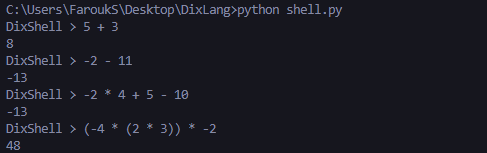
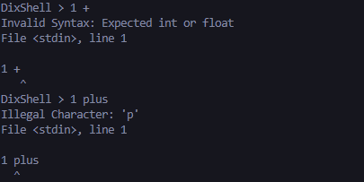

# DixLang
Yesss, you read that right! Dix...Lang. I have always wanted to do this - create my own language and at least put my DSA skills to good use...brr 😎 - but felt lazyyyy...

Out of no particular reason, I have started and chose to build an interpreted language using Python. Might think of building a compiled language after this but building this can at least satisfy my desire to learn more about how programming languages work 💪!

...and yes, I know it's gonna be buried in the cemetries of Git 💀 but I don't plan on being the next Dennis Ritchie 😅

## Current Progress

- **Arithmetic Operations:**  
  - Perform binary (addition, subtraction, multiplication, division, exponentiation) and unary (negation) operations.

- **Lexing & Parsing:**  
  - Tokenization of input for numbers, arithmetic operators, and parentheses.
  - Parsing of tokens into an abstract syntax tree (AST).

- **Interpreting:**  
  - Evaluation of the AST to calculate arithmetic expressions.
  - Error detection and location reporting for syntax errors.

## What You Can Currently Do

- Run arithmetic expressions through the interactive console, for example:
  - `5 + 3`
  - `-2 * (4 + 1)`
  - `2 ^ 2`

- View immediate results of calculations and detailed error messages on faulty expressions.

## Snapshots

Snapshots of the program in action will be included below to demonstrate:
- The interactive shell processing valid arithmetic expressions.
- The error output when syntax errors are detected.
  

